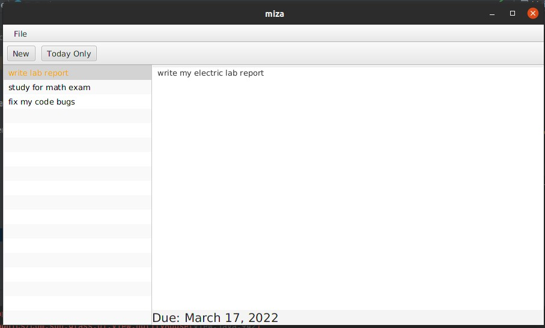
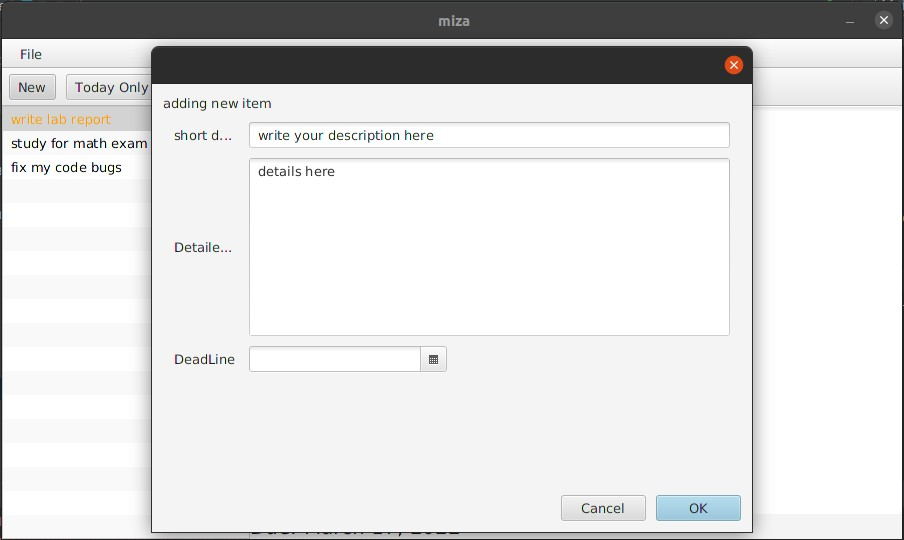

# toDoListApp
A simple javaFX Desktop app for displaying todo list of the user.

the main layout for the app 

you can add new todo items specifying the short and detailed description and the deadline.

to avoid clutter you can display you today's tasks only.

